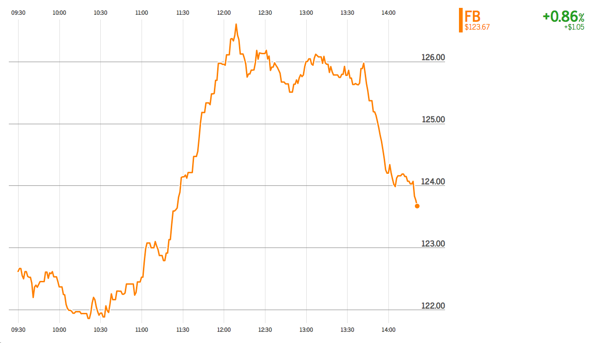
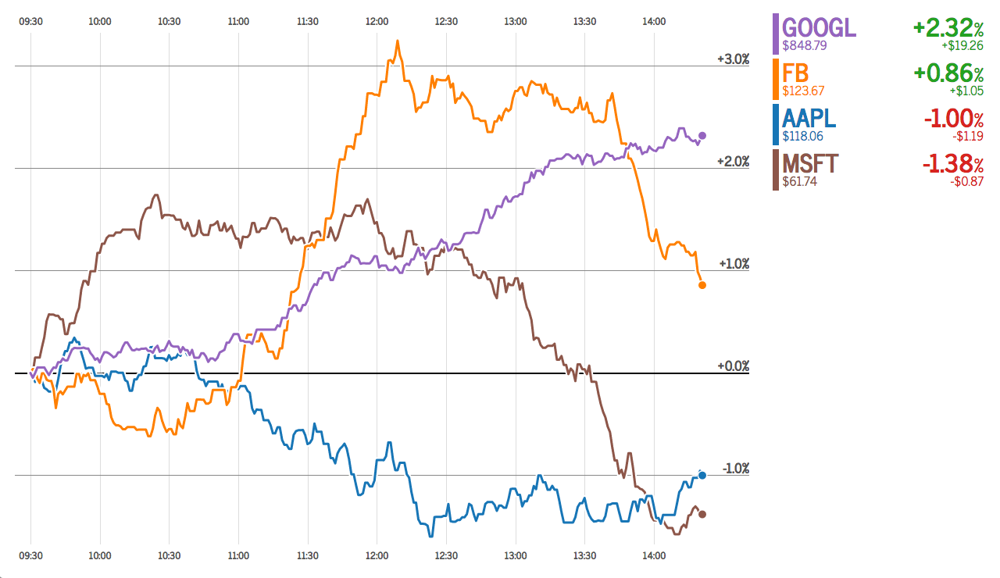

# Frontend Development Test Task

**IMPORTANT: Please don't fork this repository. Make your own by cloning this one and changing ORIGIN to your repository.**


## Description

Your task is to implement a dashboard with a stock chart. It should be able to display two chart types:

1. Intraday **price** chart, showing price at every timestamp: `F(t) = P(t)` 
2. Intraday **change** chart showing percent change for every timestamp relative to the start of the day: `F(t) = (P(t) - P(0))/P(0) * 100%` 

Your dashboard should allow users to show/hide stocks. Chart #1 should be displayed when a single stock is selected; chart #2 — which is suitable for stock comparison — should be displayed when multiple stocks are selected. Here's a [Google Finance example](https://www.google.com/finance?q=aapl%2C+msft%2C+goog%2C+fb&ei=k9StWJj0KsHSeOjOt9gF) of such a chart.

As evident from the images above, we've designed the chart for you, and **you should implement this chart's design as faithfully as you can.** You can access these images and other design specs in the [design directory](design) of this repository.

As for the **stock quote** to the right of the chart, you may choose to tweak it as you implement the remaining functionality outlined in the [requirements section](#requirements) below. Pay close attention to these requirements, because not all requirements are reflected in the design (specifically show/hide stocks, chart interactivity, time stamp); you will need to fill in the gaps on your own.


## Requirements

Priority is included in parentheses (1=Highest, 3=Lowest)

- The graph's implementation should closely match the design (1)
- Users should be able to show/hide stocks (1)
- A stock's details — ticker, latest price, $ change and % change — should be available (1)
- There should be an indication of the current time stamp (based on the data) (1)
- Interaction with the chart should allow users to inspect price and change values at earlier times of the day (2)
- The chart should update in real-time (3)
- The chart should reset at the end of the trading day (3)

Please use [d3.js](https://d3js.org) to implement this task. Do not use a charting library like Highcharts. If you'd like, you're more than welcome to use [React](https://facebook.github.io/react/) as well but not another framework (such as Angular, Ember, Backbone, jQuery) unless we've discussed it in advance.

## Technical info

The data is generated and served by a Node.js server, which is already implemented as part of this repository. You shouldn't have to modify any of the server code to complete this task.

The server generates data for a group of 4 stocks, simulating a full day of trading. The simulation consists of a series of ticks that represent price change over time. Each tick is made up of a stock symbol, price and timestamp. The timestamps are spaced one minute apart, but the simulation generates them at a much faster rate, which you can adjust via environment variables. 

Your chart should initally load and display the historical data, and then continue to refresh in real time as new ticks are generated by the server. To load the historical data for the (virtual) day so far, make an HTTP request to `/market-history`. To receive subsequent real-time updates, connect via WebSockets (example provided in [client/index.js](client/index.js)).

The generated data represents just a single day of trading (9:30am to 4pm). At the end of the (virtual) day, the simulation resets back to the start of a new trading day, and so should your chart.

To start the server and the simulation, after running `npm install`, run:

```
npm run start
```

Some environment variables that you can include (in the line above) in order to control the simulation:

- `EVENTS_TIMEOUT` - the speed at which to generate price changes. Default is 2000ms
- `START_AT` - E.g. `START_AT='14:20'`. Pre-generates ticks until a certain time in the day and continues to generate ticks from there. Default is 9:30, meaning don't pre-generate any ticks, since the market opens at 9:30.
- `LATE_RESPONSE` - A boolean. Supplying any value means `true`, skipping this param means `false` (the default). If true, the server will purposely wait a bit before sending back `/market-history` response, simulating a concurrency condition that hopefully your front end can deal with....
- `PORT` — server port number

## Bundling

The repository is already set up to use Webpack to build/copy the javascript, css and fonts files (see [Webpack config file](webpack.config.js)). It can handle es2015, `import` and JSX syntax. There's a watch task in `package.json` that'll watch all JS files and rebuild the bundle when they change. To start the watch process, run:

```
npm run watch
```

Note that, along with this watch task, you still need to be running the server (`npm run start`) in a separate terminal window.

The required fonts (*News Cycle* and *News Cycle Bold*) are already included in the repository and properly sourced and bundled (see [client/fonts.css](client/fonts.css)).

## About The Data

All timestamps are in UTC time and fall between 9:30am to 4pm GMT. **Hint:** all the D3 time transformation functions that you're probably familiar with (like `timeFormat()` and functions included in the `d3-time` module) also have corresponding utc-based versions that, when used correctly, will save you from having to do any timezone accounting.

The historical data returned by `/market-history` is in CSV format containing ticker, price and timestamp:

```
timestamp,ticker,price
1489483800000,AAPL,119.25
1489483800000,GOOGL,829.53
1489483800000,FB,122.62
1489483800000,MSFT,62.61
1489483860000,AAPL,119.255
1489483860000,GOOGL,829.53
```

The `market events` updates generated by the socket are in JSON format aggregated by timestamp and include price change for only the tickers whose price has changed (`change != 0`)

```
{
  "timestamp": 1489489800000,
  "changes": [
    {
      "ticker": "FB",
      "change": 0.0562
    },
    {
      "ticker": "MSFT",
      "change": -0.0184
    }
  ]
}
```

The `start new day` directive generated by the socket is in JSON format in the form:

```
{
  "timestamp": 1489483800000,
  "newDay": true
}
```

